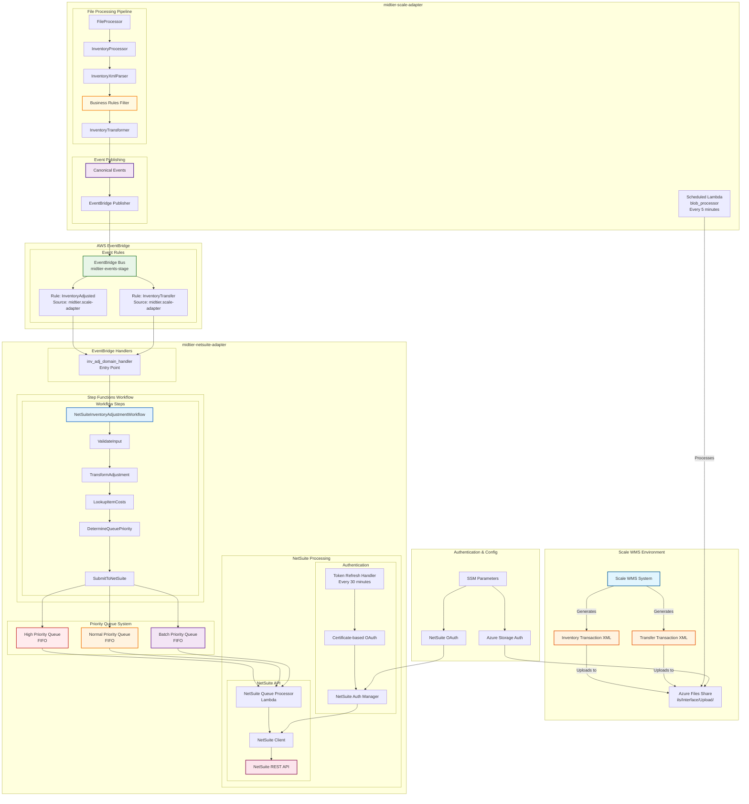
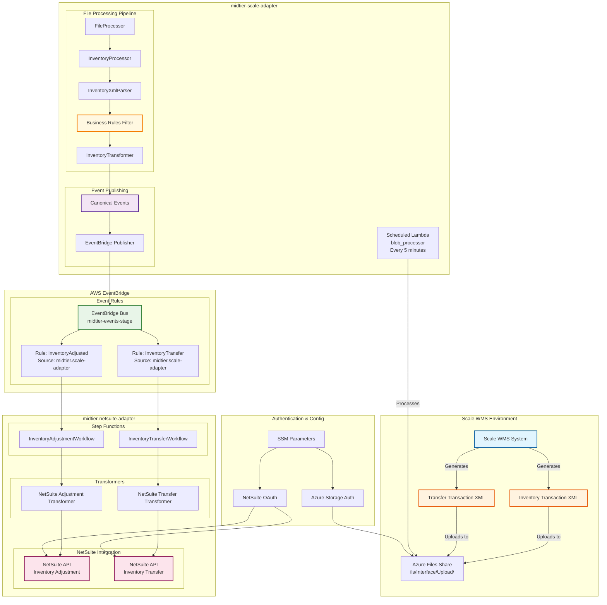

# Scale to NetSuite Upload Flows - Inventory Transfers & Adjustments

## Overview

This document explains the complete architecture and flow of how inventory transfers and adjustments are processed from Scale WMS to NetSuite. These are **upload flows** (Scale → NetSuite) that work by:

1. **Scale WMS** generates XML files containing transaction histories
2. **midtier-scale-adapter** processes these files and creates canonical events
3. **Canonical events** are published to EventBridge
4. **midtier-netsuite-adapter** consumes these events and creates NetSuite records

## Architecture Diagram



## Key Components

### 1. Scale WMS Data Generation

**Scale WMS** generates XML files containing transaction histories:

- **File Format**: `.itxupl` (Inventory Transaction Upload)
- **Location**: Azure Files Share (`ils/Interface/Upload/`)
- **Naming Pattern**: `Inventory Transaction-YYYY-MM-DD@HH-MM-SS.itxupl`
- **Content**: XML with transaction history records

**Sample XML Structure**:
```xml
<WMWROOT>
  <WMWDATA>
    <WMFWUpload>
      <Id>12345</Id>
      <Date>2024-01-15</Date>
      <TransHistories>
        <TransactionHistory>
          <TransactionType>40</TransactionType>  <!-- 40 = Adjustment, 360 = Transfer -->
          <Item>ITEM123</Item>
          <Quantity>10.0</Quantity>
          <Direction>To</Direction>
          <Warehouse>BATDC</Warehouse>
          <ToWarehouse>CTDC</ToWarehouse>
          <ReferenceType>CYCLE</ReferenceType>
          <ReferenceID>REF456</ReferenceID>
          <!-- ... more fields ... -->
        </TransactionHistory>
      </TransHistories>
    </WMFWUpload>
  </WMWDATA>
</WMWROOT>
```

### 2. File Processing Architecture

#### A. Scheduled Processing
- **Lambda Function**: `blob_processor` 
- **Schedule**: Every 5 minutes (`rate(5 minutes)`)
- **Event**: `{ "integrationType": "inventory-adjustments" }`
- **File**: `src/handlers/queue/blob-processor-handler.ts`

#### B. File Processor Flow
```typescript
// Main processing flow
FileProcessor.processFiles() → 
  initializeClients() → 
  processInventoryFile() → 
  InventoryProcessor.processFile() → 
  InventoryXmlParser.parseInventoryFile() → 
  InventoryTransformer.transformInventoryAdjustments() → 
  EventBridgePublisher.publishEvents()
```

**Component Files:**
- **FileProcessor**: `src/file-processing/processors/file-processor.ts`
- **InventoryProcessor**: `src/file-processing/processors/inventory-processor.ts`
- **InventoryXmlParser**: `src/file-processing/parsers/inventory-xml-parser.ts`
- **InventoryTransformer**: `src/file-processing/transformers/inventory-transformer.ts`
- **EventBridgePublisher**: `src/app_svcs/events/eventbridge-publisher.ts`


#### C. Business Rules & Filtering

The system applies specific business rules to determine which transactions to process:

**Inventory Adjustments (TransactionType = 40)**:
- ✅ **Include**: All adjustment types except excluded ones
- ❌ **Exclude**: `ReferenceType` = "Whse Xfer" or "Netsuite POS allocation"

**Inventory Transfers (TransactionType = 360)**:
- ✅ **Include**: Only transactions with `Direction = "From"`
- ❌ **Exclude**: `ReferenceType` = "Netsuite POS allocation"

**File**: `src/file-processing/transformers/inventory-transformer.ts` (filtering logic)

### 3. Data Transformation

#### A. Grouping Logic
Transactions are grouped by `ReferenceID` to create logical adjustment batches:

```typescript
// Group transactions by reference ID
const groupedTransactions = this.groupTransactionsByReference(parsedData.TransHistories);

// Create one canonical event per reference group
for (const [referenceId, transactions] of groupedTransactions) {
  const adjustmentEvent = await this.createAdjustmentEvent(
    fileName, parsedData, referenceId, transactions
  );
  events.push(adjustmentEvent);
}
```

#### B. Canonical Event Structure

**Inventory Adjustment Event**:
```json
{
  "eventType": "inventory.adjusted",
  "source": "midtier-scale-adapter",
  "timestamp": "2024-01-15T10:30:00.000Z",
  "fileName": "Inventory Transaction-2024-01-15@10-30-00.itxupl",
  "fileId": "12345",
  "adjustment": {
    "identifiers": {
      "primaryIdentifier": "12345-REF456",
      "systemReferences": [{
        "system": "Scale",
        "id": "REF456",
        "type": "ReferenceID"
      }],
      "batchIdentifier": "12345",
      "referenceNumber": "REF456"
    },
    "adjustmentType": "CYCLE_COUNT",
    "adjustmentDate": "2024-01-15T10:30:00.000Z",
    "effectiveDate": "2024-01-15T10:30:00.000Z",
    "status": "PROCESSED",
    "reason": {
      "reasonCode": "CYCLE",
      "reasonDescription": "Cycle Count Adjustment",
      "category": "INVENTORY_ADJUSTMENT"
    },
    "location": {
      "primaryIdentifier": "BATDC",
      "warehouse": "BATDC",
      "systemReferences": [{
        "system": "Scale",
        "id": "BATDC",
        "type": "Warehouse"
      }]
    },
    "lines": [{
      "lineNumber": 1,
      "item": {
        "primaryIdentifier": "ITEM123",
        "systemReferences": [{
          "system": "Scale",
          "id": "ITEM123",
          "type": "Item"
        }]
      },
      "quantity": {
        "value": 10.0,
        "unit": "EA"
      },
      "location": {
        "primaryIdentifier": "BATDC",
        "warehouse": "BATDC",
        "workZone": "MAIN"
      },
      "beforeQuantity": {
        "onHand": 100.0,
        "allocated": 10.0,
        "inTransit": 0.0,
        "suspense": 0.0
      },
      "afterQuantity": {
        "onHand": 110.0,
        "allocated": 10.0,
        "inTransit": 0.0,
        "suspense": 0.0
      },
      "extensions": {
        "Scale": {
          "internalId": "789",
          "internalKeyId": "790",
          "referenceLineNum": 1,
          "beforeStatus": "Available",
          "afterStatus": "Available"
        }
      }
    }],
    "initiatedBy": {
      "userName": "SCALEUSER",
      "system": "Scale"
    },
    "extensions": {
      "Scale": {
        "processStamp": "PS123",
        "uploadInterfaceBatch": "BATCH456",
        "fileName": "Inventory Transaction-2024-01-15@10-30-00.itxupl",
        "userDef1": "Custom1",
        "userDef2": "Custom2",
        "userDef3": "Custom3",
        "userDef4": "Custom4",
        "isTransfer": false
      }
    }
  }
}
```

**Inventory Transfer Event**:
```json
{
  "eventType": "inventory.adjusted",
  "source": "midtier-scale-adapter",
  "adjustment": {
    "adjustmentType": "TRANSFER",
    "extensions": {
      "Scale": {
        "toWarehouse": "CTDC",
        "isTransfer": true
      }
    }
    // ... similar structure to adjustment
  }
}
```

### 4. Event Publishing

#### A. EventBridge Integration
```typescript
// Uses midtier-core createEvent function
const result = await createEvent(
  'scale-adapter',           // clientId
  'midtier-scale-adapter',   // namespace
  generateUuid(),            // apiGatewayId
  canonicalEvent,            // body
  'inventory.adjusted',      // topic
  'json'                     // format
);
```

#### B. Configuration
- **Event Bus**: `midtier-events-{stage}`
- **Source**: `midtier.scale-adapter`
- **Detail Type**: `InventoryAdjusted`
- **Retry Logic**: 3 attempts with exponential backoff

### 5. Authentication & Infrastructure

#### A. Azure Files Authentication
```typescript
// Connection string from SSM
const connectionString = process.env.AZURE_STORAGE_CONNECTION_STRING;
const shareClient = new ShareServiceClient(connectionString);
```

**File**: `src/app_svcs/blob/azure-files-client.ts`

#### B. AWS Infrastructure
- **S3 Buckets**: 
  - `midtier-configurations-{stage}` - Configuration files
  - `midtier-scale-adapter-output-{stage}` - Processing outputs
- **SSM Parameters**:
  - `/midtier-scale-adapter/{stage}/azure/blobConnectionString`
  - `/midtier-scale-adapter/{stage}/eventbridge/busName`
- **EventBridge Rules**: Configured via Terraform

**Files**: 
- `infrastructure/terraform/eventbridge.tf`
- `serverless.yml` (S3 bucket references)
- `src/utils/config.ts` (SSM parameter handling)

#### C. IAM Permissions
```json
{
  "Version": "2012-10-17",
  "Statement": [
    {
      "Effect": "Allow",
      "Action": [
        "ssm:GetParameter",
        "ssm:GetParameters"
      ],
      "Resource": "arn:aws:ssm:*:*:parameter/midtier-scale-adapter/*"
    },
    {
      "Effect": "Allow",
      "Action": [
        "events:PutEvents"
      ],
      "Resource": "*"
    }
  ]
}
```

### 6. Error Handling & Monitoring

#### A. Error Scenarios
- **File Parse Errors**: Invalid XML structure
- **Business Rule Violations**: Unsupported transaction types
- **EventBridge Failures**: Network/permission issues
- **Azure Files Issues**: Connection failures

#### B. Error Handling Strategy
```typescript
// File-level error handling
try {
  const events = await this.inventoryProcessor.processFile(fileName, content);
  await this.eventBridgePublisher.publishEvents(events);
  await this.moveToCompletedDirectory(filePath);
} catch (error) {
  logger.error('File processing failed', { fileName, error });
  await this.moveToErrorDirectory(filePath, error.message);
}
```

#### C. Monitoring
- **CloudWatch Logs**: Detailed processing logs
- **Error Tracking**: Failed files moved to error directory
- **Metrics**: Files processed, events published, errors

## Field Mappings

### Inventory Adjustments

| Scale Field | Canonical Field | NetSuite Field | Notes |
|-------------|-----------------|----------------|-------|
| `TransactionType` | `adjustmentType` | N/A | 40 = Adjustment |
| `Item` | `item.primaryIdentifier` | `item.externalid` | Item identifier |
| `Quantity` | `quantity.value` | `adjustqtyby` | Calculated: AfterOnHandQty - BeforeOnHandQty |
| `ReferenceType` | `reason.reasonCode` | `custbody_dwr_inv_adj_scale_adj_type` | Reason code |
| `Warehouse` | `location.warehouse` | `location` | Warehouse/location |
| `UserName` | `initiatedBy.userName` | `user_name` | User who initiated |
| `DateTimeStamp` | `adjustmentDate` | `trandate` | Transaction date |
| `UserDef1-4` | `extensions.Scale.userDef1-4` | `custbody_hmk_ic_comment1-4` | Custom fields |

**Reference Files**:
- Scale Field Mappings: `docs/Manhattan Scale Integrations Mapping Document - Inventory Transactions (1)(Inventory_Adjustment).csv`
- Canonical Model: `midtier-integration-core/src/models/domains/inventory/adjustment-events.ts`
- NetSuite Types: `midtier-netsuite-adapter/src/domains/inventory-adjustment/types/inventory-adjustment-types.ts`

### Inventory Transfers

| Scale Field | Canonical Field | NetSuite Field | Notes |
|-------------|-----------------|----------------|-------|
| `TransactionType` | `adjustmentType` | N/A | 360 = Transfer |
| `Item` | `item.primaryIdentifier` | `item` | Item identifier |
| `Quantity` | `quantity.value` | `adjustqtyby` | Transfer quantity |
| `Warehouse` | `location.warehouse` | `location` | From location |
| `ToWarehouse` | `extensions.Scale.toWarehouse` | `transferlocation` | To location |
| `Direction` | N/A | N/A | Must be "From" |
| `UserName` | `initiatedBy.userName` | `user_name` | User who initiated |

**Reference Files**:
- Scale Field Mappings: `docs/Manhattan Scale Integrations Mapping Document - Inventory Transactions (1)(Inventory_Transfer).csv`
- Canonical Model: `midtier-integration-core/src/models/domains/inventory/adjustment-events.ts`
- NetSuite Types: `midtier-netsuite-adapter/src/domains/inventory-adjustment/types/inventory-adjustment-types.ts`

## Data Flow Summary

### 1. Inventory Adjustment Flow
```
Scale WMS → XML File → Azure Files → 
Scheduled Lambda → File Processor → 
XML Parser → Business Rules Filter → 
Canonical Transform → EventBridge → 
NetSuite Adapter → NetSuite API
```

### 2. Inventory Transfer Flow
```
Scale WMS → XML File → Azure Files → 
Scheduled Lambda → File Processor → 
XML Parser → Transfer Filter → 
Canonical Transform → EventBridge → 
NetSuite Adapter → NetSuite API
```

## Configuration

### Environment Variables
```bash
# Azure Storage
AZURE_STORAGE_CONNECTION_STRING=DefaultEndpointsProtocol=https;...
AZURE_SHARE_NAME=ils

# AWS
EVENT_BUS_NAME=midtier-events-{stage}
STAGE={stage}

# Processing
MAX_FILES_PER_RUN=10
ENABLE_FILE_MOVEMENT=true
ENABLE_EVENT_PUBLISHING=true
```

### File Type Configuration
```typescript
fileTypes: {
  inventory: {
    pattern: /^Inventory Transaction-\d{4}-\d{2}-\d{2}@\d{2}-\d{2}-\d{2}\.itxupl$/,
    extension: '.itxupl',
    processorType: 'inventory'
  }
}
```

**File**: `src/file-processing/config/processor-config.ts`


### Diagram


## 7. NetSuite Adapter Architecture

### A. EventBridge Handler (Entry Point)

The NetSuite adapter receives canonical events from EventBridge and processes them through a Step Functions workflow:

**File**: `midtier-netsuite-adapter/src/domains/inventory-adjustment/handlers/entry-handler.ts`

```typescript
// Entry handler receives events from EventBridge
export async function entryHandler(
  event: EventBridgeEvent<'MidtierEventsStream', any>,
  context: Context
): Promise<{ success: boolean; executionArn?: string; error?: string }> {
  
  // Extract canonical adjustment data
  const adjustmentData = event.detail.data.adjustment;
  
  // Transform to internal format
  const transformedEvent: InventoryAdjustmentEvent = {
    eventId: event.detail.data.fileId || event.id,
    eventType: 'InventoryAdjusted',
    payload: { adjustment: adjustmentData }
  };
  
  // Start Step Functions workflow
  const workflowInput: InventoryAdjustmentWorkflowInput = {
    correlationId: uuidv4(),
    eventId: transformedEvent.eventId,
    input: transformedEvent,
    executionId: correlationId
  };
  
  const executionResult = await stepFunctions.startExecution('inventory_adjustment', {
    correlationId,
    input: workflowInput
  });
  
  return { success: true, executionArn: executionResult.executionArn };
}
```

### B. Step Functions Workflow

The NetSuite adapter uses a multi-step workflow to process inventory adjustments:

**Step 1: ValidateInput**
- Validates canonical event structure
- Ensures required fields are present
- Checks business rules compliance
- **File**: `midtier-netsuite-adapter/src/domains/inventory-adjustment/handlers/validate-handler.ts`

**Step 2: TransformAdjustment**
- Transforms canonical format to NetSuite-ready format
- Maps Scale field names to NetSuite field names
- Prepares adjustment header and line items
- **File**: `midtier-netsuite-adapter/src/domains/inventory-adjustment/handlers/transform-handler.ts`

**Step 3: LookupItemCosts**
- Queries NetSuite for item cost information using SuiteQL
- Supports both legacy (3-query) and simplified (single-query) approaches
- Handles cost lookups with task tokens for async processing
- **Files**: 
  - `midtier-netsuite-adapter/src/domains/inventory-adjustment/handlers/cost-lookup-handler.ts` (legacy)
  - `midtier-netsuite-adapter/src/domains/inventory-adjustment/handlers/cost-lookup-handler-single.ts` (simplified)
  - `midtier-netsuite-adapter/src/domains/inventory-adjustment/handlers/cost-lookup-handler-simple.ts` (queue-based)

**Step 4: DetermineQueuePriority**
- Applies account/department overrides
- Determines appropriate priority queue (High/Normal/Batch)
- Builds final NetSuite payload with all enrichments
- **File**: `midtier-netsuite-adapter/src/domains/inventory-adjustment/handlers/queue-determination-handler.ts`

**Step 5: SubmitToNetSuite**
- Queues the final payload to appropriate SQS queue
- Uses task tokens to wait for completion
- Handles success/failure responses
- **File**: `midtier-netsuite-adapter/src/domains/inventory-adjustment/handlers/submit-handler.ts`

### C. Priority Queue System

The NetSuite adapter uses a three-tier priority queue system:

**High Priority Queue (`HIGH_PRIORITY_QUEUE_URL`)**
- FIFO queue for urgent transactions
- Visibility timeout: 300 seconds
- Max receive count: 3 (then moves to DLQ)
- Used for: Critical adjustments, real-time operations

**Normal Priority Queue (`NORMAL_PRIORITY_QUEUE_URL`)**
- FIFO queue for standard transactions
- Visibility timeout: 600 seconds
- Max receive count: 3 (then moves to DLQ)
- Used for: Regular inventory adjustments

**Batch Priority Queue (`BATCH_PRIORITY_QUEUE_URL`)**
- FIFO queue for bulk operations
- Visibility timeout: 900 seconds
- Max receive count: 3 (then moves to DLQ)
- Used for: Large batch adjustments, transfers

**Configuration File**: `midtier-netsuite-adapter/serverless.yml` (CloudFormation resources section)

### D. NetSuite Queue Processor

The queue processor handles all NetSuite API calls with concurrency management:

**File**: `midtier-netsuite-adapter/src/shared/handlers/netsuite-queue-processor.ts`

```typescript
export const handler = async (event: SQSEvent, context: Context): Promise<void> => {
  const client = NetsuiteClient.getInstance();
  
  for (const record of event.Records) {
    const message: NetSuiteOperationMessage = JSON.parse(record.body);
    
    try {
      // Process the NetSuite operation
      const response = await client.makeRequest({
        method: message.method,
        endpoint: message.endpoint,
        body: message.body,
        params: message.params
      });
      
      // Send success back to Step Functions if task token provided
      if (message.taskToken) {
        await sfn.send(new SendTaskSuccessCommand({
          taskToken: message.taskToken,
          output: JSON.stringify(response)
        }));
      }
    } catch (error) {
      // Handle error and notify Step Functions
      if (message.taskToken) {
        await sfn.send(new SendTaskFailureCommand({
          taskToken: message.taskToken,
          error: error.name,
          cause: error.message
        }));
      }
    }
  }
};
```

### E. Authentication System

**Token Refresh Handler**
- Scheduled to run every 30 minutes
- Uses certificate-based OAuth with NetSuite
- Generates JWT tokens for API authentication
- Stores tokens in SSM Parameter Store
- **File**: `midtier-netsuite-adapter/src/shared/handlers/token-refresh-handler.ts`

```typescript
export const handler = async (event: any, context: any): Promise<any> => {
  // Load credentials from SSM
  const credentials = await loadCredentials(ssmClient, stage);
  
  // Generate JWT token using private key
  const tokenData = await generateJWTToken(credentials);
  
  // Store in SSM for queue processor to use
  await storeTokenInSSM(ssmClient, stage, tokenData);
};
```

**NetSuite Auth Manager**
- Manages token lifecycle and refresh
- Handles authentication for all NetSuite API calls
- Implements retry logic for expired tokens
- **File**: `midtier-netsuite-adapter/src/app_svcs/netsuite-auth.ts`

### F. NetSuite Client

The NetSuite client provides a unified interface for all NetSuite operations:

**File**: `midtier-netsuite-adapter/src/shared/clients/netsuite-client.ts`

```typescript
export class NetsuiteClient {
  private authManager: NetSuiteAuthManager;
  private axiosInstance: AxiosInstance;
  
  async makeRequest(config: NetSuiteRequestConfig): Promise<any> {
    // Get valid token from auth manager
    const token = await this.authManager.getValidToken();
    
    // Make authenticated request
    const response = await this.axiosInstance.request({
      ...config,
      headers: {
        ...config.headers,
        'Authorization': `Bearer ${token}`
      }
    });
    
    return response.data;
  }
}
```

### G. Cost Lookup Mechanism

The cost lookup system queries NetSuite for item costs using SuiteQL:

**Legacy Approach (3 Queries)**
1. Query item master data
2. Query location-specific costs
3. Query department-specific costs
- **File**: `midtier-netsuite-adapter/src/domains/inventory-adjustment/handlers/cost-lookup-handler.ts`

**Simplified Approach (Single Query)**
```sql
SELECT 
  i.id as itemInternalId,
  i.externalid as itemExternalId,
  ic.averagecost,
  ic.locationid,
  CASE 
    WHEN ic.averagecost IS NOT NULL THEN ic.averagecost
    ELSE 0
  END as finalCost
FROM item i
LEFT JOIN itemcost ic ON i.id = ic.item
WHERE i.externalid IN ('ITEM123', 'ITEM456')
  AND ic.locationid = 88
```

**Files**: 
- `midtier-netsuite-adapter/src/domains/inventory-adjustment/handlers/cost-lookup-handler-single.ts`
- `midtier-netsuite-adapter/src/domains/inventory-adjustment/handlers/process-cost-data-handler.ts`

### H. Error Handling & Dead Letter Queues

**Dead Letter Queue Processing**
- Each priority queue has a corresponding DLQ
- DLQ processors handle failed messages
- Implements exponential backoff and retry logic
- Logs detailed error information for debugging

**Error Types**
- **Validation Errors**: Invalid data format or missing fields
- **Authentication Errors**: Token expiration or invalid credentials
- **Rate Limit Errors**: NetSuite API rate limiting
- **Business Rule Errors**: NetSuite business logic violations

**Files**: 
- `midtier-netsuite-adapter/src/shared/handlers/dlq-processor.ts`
- `midtier-netsuite-adapter/src/shared/utils/error-handler.ts`

### I. Infrastructure Components

**Step Functions State Machine**
```yaml
StepFunctionsRole:
  Type: AWS::IAM::Role
  Properties:
    AssumeRolePolicyDocument:
      Statement:
        - Effect: Allow
          Principal:
            Service: states.amazonaws.com
          Action: sts:AssumeRole
    Policies:
      - PolicyName: InventoryAdjustmentStepFunctionsExecutionPolicy
        PolicyDocument:
          Statement:
            - Effect: Allow
              Action: lambda:InvokeFunction
              Resource: [all workflow lambda functions]
```

**SQS Queue Configuration**
```yaml
NetSuiteApiHighPriorityQueue:
  Type: AWS::SQS::Queue
  Properties:
    QueueName: netsuite-api-high-priority-${stage}.fifo
    FifoQueue: true
    VisibilityTimeout: 300
    RedrivePolicy:
      deadLetterTargetArn: !GetAtt NetSuiteApiHighPriorityDLQ.Arn
      maxReceiveCount: 3
```

**SSM Parameters**
```
/midtier-netsuite-adapter/${stage}/netsuite/account
/midtier-netsuite-adapter/${stage}/netsuite/client_id
/midtier-netsuite-adapter/${stage}/netsuite/certificate_id
/midtier-netsuite-adapter/${stage}/netsuite/private_key
/midtier-netsuite-adapter/${stage}/netsuite/access_token
```

**Infrastructure Files**:
- `midtier-netsuite-adapter/serverless.yml` (Step Functions, SQS, IAM roles)
- `midtier-netsuite-adapter/infrastructure/terraform/` (Terraform modules)
- `midtier-netsuite-adapter/src/shared/services/stepfunctions-service.ts` (Step Functions interaction)
- `midtier-netsuite-adapter/src/shared/services/configuration-service.ts` (SSM parameter management)

## 8. Complete Data Flow

### End-to-End Processing Flow

```
Scale WMS → XML File → Azure Files → 
[midtier-scale-adapter]
  Scheduled Lambda → File Processor → 
  XML Parser → Business Rules Filter → 
  Canonical Transform → EventBridge → 
[AWS EventBridge]
  Event Rules → 
[midtier-netsuite-adapter]
  Entry Handler → Step Functions → 
  Validate → Transform → Cost Lookup → 
  Queue Determination → Submit → 
  Priority Queue → Queue Processor → 
  NetSuite Client → NetSuite API
```

### Timing and Scheduling

- **Scale to Azure Files**: Real-time as transactions occur
- **Azure Files Processing**: Every 5 minutes (scheduled)
- **EventBridge to NetSuite**: Near real-time (< 5 seconds)
- **Step Functions Processing**: 30-300 seconds depending on complexity
- **NetSuite API Calls**: 1-5 seconds per call
- **Token Refresh**: Every 30 minutes (scheduled)

### Concurrency and Throughput

- **Scale Adapter**: Processes multiple files in parallel
- **NetSuite Queue Processor**: Reserved concurrency of 8 (matches NetSuite API limits)
- **Priority Queues**: FIFO ordering with content-based deduplication
- **Step Functions**: Can handle up to 25,000 concurrent executions

## Next Steps

This architecture is designed to be extensible for adding:
1. **Additional Transaction Types** - Purchase orders, receipts, etc.
2. **Enhanced Error Handling** - Dead letter queues, retry mechanisms
3. **Real-time Processing** - Event-driven file processing instead of scheduled
4. **Monitoring & Alerting** - CloudWatch dashboards and alarms
5. **Performance Optimization** - Batch processing and enhanced caching

The canonical event structure ensures consistency across all integration points and provides a clear contract between the Scale adapter and NetSuite adapter components. 
