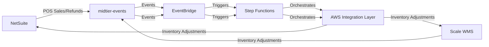
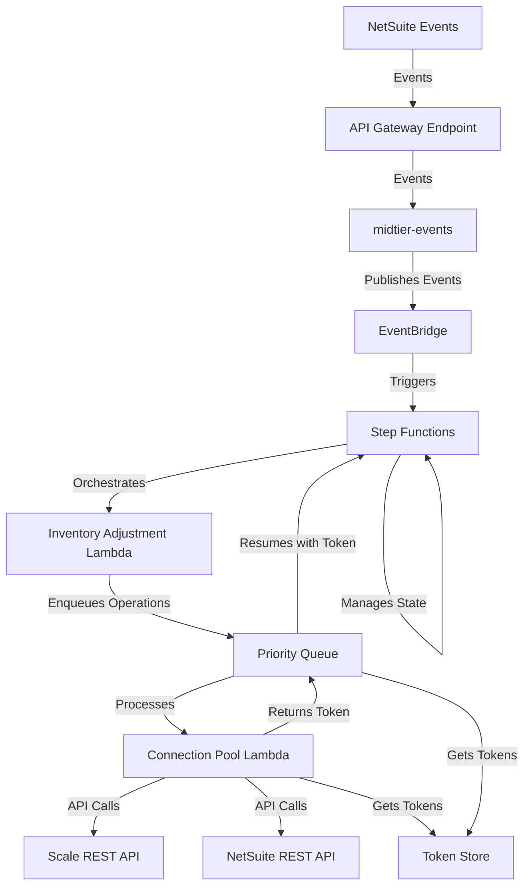
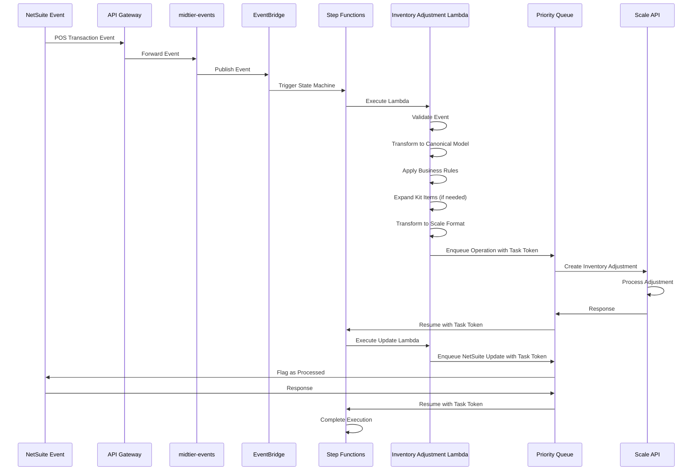
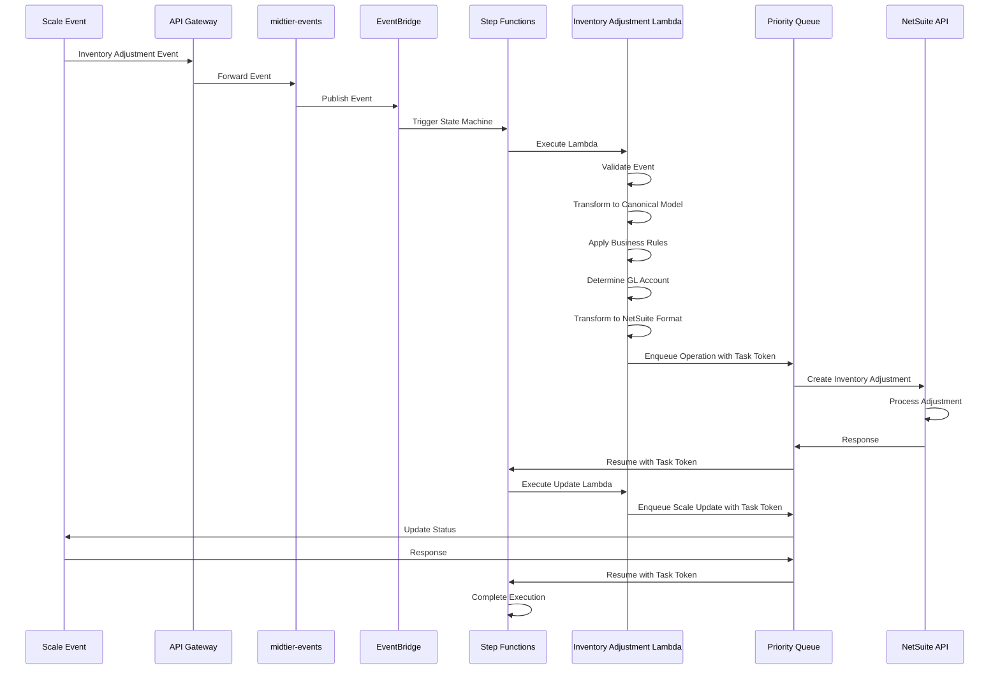
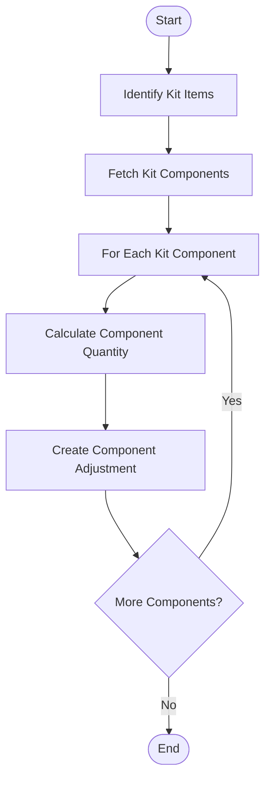
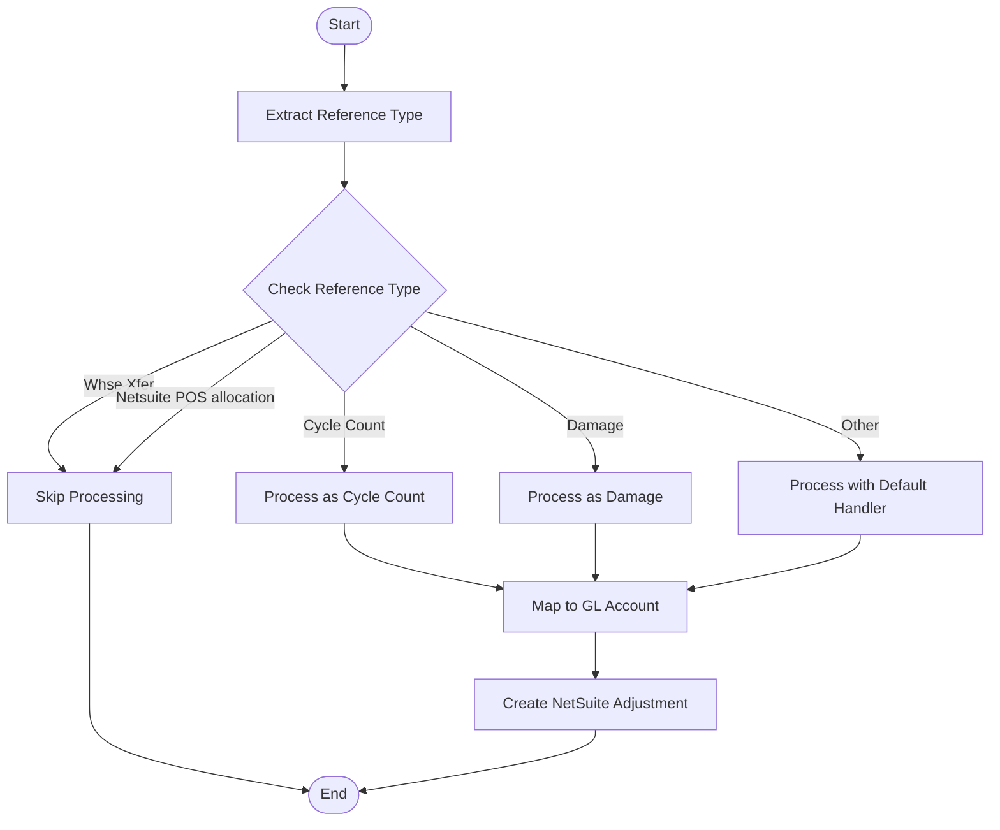
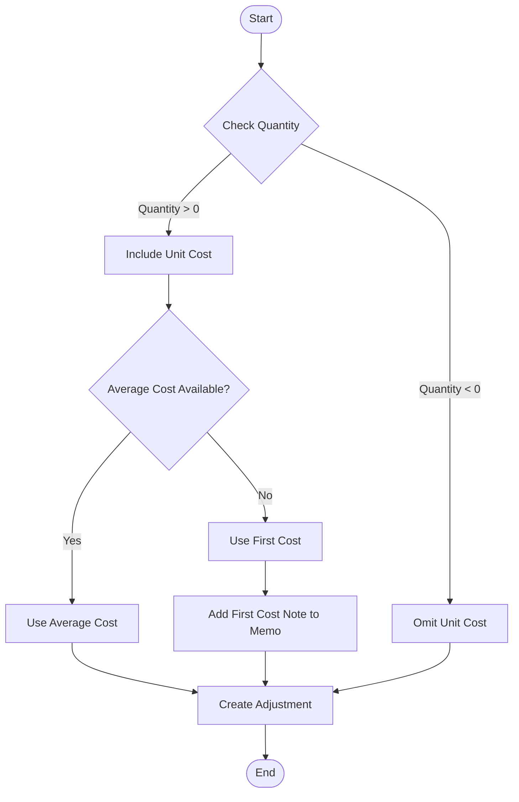

# Inventory Adjustments Implementation Plan

## Overview

This document outlines the implementation plan for the Inventory Adjustments integration between NetSuite and Scale. The Inventory Adjustments functionality enables bidirectional synchronization of inventory data:

1. **Scale to NetSuite**: Inventory adjustments performed in Scale are sent to NetSuite to maintain inventory accuracy
2. **NetSuite to Scale**: POS sales and refund transactions in outlet locations are sent from NetSuite to Scale as inventory adjustments

This implementation will migrate the current .NET-based integration to a new AWS-based architecture, ensuring functional parity while improving reliability, scalability, and maintainability.

## Data Flow Overview



> **Note:** The midtier-events service already exists and handles the initial event creation from NetSuite. This component does not need modification for the inventory adjustments implementation.

## Current Implementation Analysis

The current Inventory Adjustments implementation in the erp-millerknollretail-scaleinterface .NET application handles two primary flows:

### NetSuite to Scale Flow (POS Adjustments)

1. **Data Retrieval**: 
   - The application retrieves POS transactions using two saved searches:
     - `customsearch_dwr_annex_inv_adj` for sales (invoices)
     - `customsearch_dwr_annex_inv_adj_2` for refunds (credit memos)
   - Only POS transactions from specific outlet locations are included

2. **Data Processing**:
   - For each POS transaction:
     - The transaction type is identified (invoice, credit memo, item fulfillment, item receipt)
     - The warehouse and location are determined from dictionary mappings
     - For kit items, components are expanded and individual adjustments created
     - Inventory adjustments are inserted into Scale via `NS_Inv_adj_insert()`
     - POS transactions are flagged as processed in NetSuite

3. **Key Methods**:
   - `getPosAdjustments()`: Main entry point that retrieves POS transactions
   - `processPOSSalesAdjustments()`: Processes transactions and creates Scale adjustments
   - `flagPOSSales()` / `flagPOSCreditMemosAndItemReceipts()`: Updates NetSuite records as processed

### Scale to NetSuite Flow (Inventory Adjustments)

1. **Data Retrieval**:
   - The application retrieves inventory adjustments via `NS_GetInventoryAdjustments()` stored procedure
   - Only adjustments with specific reference types are included
   - Quantity is calculated as the difference between after and before on-hand quantities

2. **Data Processing**:
   - For each adjustment:
     - Item details (internal ID, average cost) are retrieved from NetSuite
     - The appropriate GL account is determined based on the reference type
     - An InventoryAdjustment record is created in NetSuite
     - The adjustment is marked as processed in Scale

3. **Key Methods**:
   - `getScaleAdjustments()`: Retrieves inventory adjustments from Scale
   - `addItemAdjustment()`: Creates InventoryAdjustment records in NetSuite
   - `getItemAndAverageCost()`: Retrieves item details from NetSuite

### Business Rules

1. **Location Filtering**:
   - Only POS transactions from specified outlet locations are processed
   - Locations are mapped to Scale warehouses via dictionary tables

2. **Reference Type Handling**:
   - Scale adjustments with specific reference types are sent to NetSuite
   - Each reference type maps to a specific GL account in NetSuite
   - Certain reference types ('Whse Xfer', 'Netsuite POS allocation') are excluded

3. **Kit Item Expansion**:
   - Kit items are expanded into component items
   - Component quantities are calculated based on the kit quantity and component quantity
   - Each component is processed as a separate inventory adjustment

4. **Unit Cost Handling**:
   - Unit cost is included for positive adjustments
   - Unit cost is omitted for negative adjustments (per CMP 05842030)
   - If average cost is unavailable, first cost is used with a notation in the memo

5. **Status Tracking**:
   - Scale adjustments set USER_DEF5 to 'NS processing' during processing
   - NetSuite POS transactions are flagged with custcol_dwr_adjusted_inv_wms=true when processed

## AWS Implementation Design

The new AWS-based architecture for Inventory Adjustments will follow the same patterns established for Item Download, with adaptations specific to inventory adjustment requirements. The implementation will leverage Step Functions for state management and workflow orchestration.

### Architecture Diagram



> **Note:** The midtier-events service already exists and handles the initial event creation and publishing to EventBridge. This component does not need modification for the inventory adjustments implementation.

### Sequence Diagrams

#### NetSuite to Scale Flow (POS Adjustments)



#### Scale to NetSuite Flow (Inventory Adjustments)



## Component Details

### 1. NetSuite Event Generation

**Purpose**: Generate events when POS transactions (invoices, credit memos) are created/updated in NetSuite.

**Implementation**:
- SuiteScript 2.0 event handlers for Invoice and Credit Memo records
- Custom scheduled script to identify POS transactions ready for processing in outlet locations
- Event payload will include all necessary data for processing, including the specific event type
- Events are sent to midtier-events, which already exists and handles event processing

**Event Types**:
- `POSSaleCreated`: Triggered when a POS sale (invoice) is created at an outlet location
- `POSRefundCreated`: Triggered when a POS refund (credit memo) is created at an outlet location

### 2. Scale Event Generation

**Purpose**: Generate events when inventory adjustments are created/updated in Scale.

**Implementation**:
- Scale integration with API Gateway to send adjustment events
- Event payload will include adjustment details (item, quantity, warehouse, reason code)
- Polling mechanism as a fallback if Scale cannot send events directly

**Event Types**:
- `InventoryAdjustmentCreated`: Triggered when an inventory adjustment is created in Scale
- `InventoryTransferCreated`: Triggered when an inventory transfer is created in Scale

### 3. Inventory Adjustment Lambda

**Purpose**: Process inventory adjustment events and coordinate the transformation and routing of data.

**Implementation**:
- Node.js Lambda function
- Event-driven architecture
- Separation of concerns with clear responsibilities
- Integration with Step Functions for state management

**Functions**:
- Validate incoming events
- Transform data between systems
- Apply business rules
- Enqueue operations for execution with task tokens
- Handle error conditions and retries

**Design Pattern**: The Inventory Adjustment Lambda will implement a unique reference type routing pattern:

```typescript
// Reference Type Routing Pattern - Unique to Inventory Adjustments processing
export class ReferenceTypeRouter {
  private readonly routingMap: Map<string, ReferenceTypeHandler>;
  
  constructor() {
    this.routingMap = new Map();
    // Register handlers for different reference types
    this.routingMap.set('Cycle Count', new CycleCountHandler());
    this.routingMap.set('Damage', new DamageHandler());
    this.routingMap.set('Unexpected Receipt', new UnexpectedReceiptHandler());
    // Add more handlers as needed
  }
  
  async routeAdjustment(event: InventoryAdjustmentEvent): Promise<void> {
    const referenceType = event.payload.referenceType;
    
    if (this.routingMap.has(referenceType)) {
      await this.routingMap.get(referenceType)!.handle(event);
    } else {
      // Use default handler for unregistered reference types
      await new DefaultAdjustmentHandler().handle(event);
    }
  }
}
```

This pattern allows for specialized handling of different adjustment types while maintaining a clean architecture.

### 4. Priority Queue

**Purpose**: Manage operations that need to be executed against external systems.

**Implementation**:
- SQS queue with prioritization
- Dead letter queue for failed operations
- Retry mechanism with exponential backoff
- Task token pattern for asynchronous callbacks to Step Functions

**Operation Types**:
- `CreateInventoryAdjustmentInScale`: Create an inventory adjustment in Scale
- `CreateInventoryAdjustmentInNetSuite`: Create an inventory adjustment in NetSuite
- `UpdateInventoryAdjustmentStatusInScale`: Update adjustment status in Scale
- `UpdatePOSTransactionInNetSuite`: Update POS transaction status in NetSuite

### 5. Connection Pool Lambda

**Purpose**: Execute operations against external systems with proper concurrency management.

**Implementation**:
- Node.js Lambda function
- Connection pooling for API calls
- Rate limiting to respect API constraints
- Task token handling for asynchronous callbacks

**Functions**:
- Execute operations from the queue
- Handle authentication with external systems
- Manage concurrency and rate limits
- Return task tokens to Step Functions upon completion
- Report operation results

### 6. Step Functions

**Purpose**: Orchestrate the inventory adjustment workflow and maintain state.

**Implementation**:
- State machines for different inventory adjustment flows
- Wait states with task tokens for asynchronous operations
- Error handling and retry logic
- Execution history for auditing and troubleshooting

**State Machines**:
- `POSAdjustmentWorkflow`: Orchestrate the flow of POS transactions from NetSuite to Scale
- `ScaleAdjustmentWorkflow`: Orchestrate the flow of inventory adjustments from Scale to NetSuite
- `ErrorHandlingWorkflow`: Manage error recovery and retry logic

**Benefits**:
- Visual workflow representation
- Built-in state management
- Automatic retry handling
- Execution history and tracing

## Data Mapping

### NetSuite to Scale (POS Transaction to Inventory Adjustment)

The NetSuite adapter service will transform POS transaction data to canonical events, which will then be transformed to Scale format by the Scale adapter service.

#### Field Mapping (NetSuite → Canonical → Scale)

| NetSuite Field | Canonical Field | Scale Field | Transformation |
|----------------|-----------------|-------------|----------------|
| basic.tranId | transactionId | NSTranId | Direct mapping |
| itemJoin.itemId | itemId | SkuCode | Direct mapping |
| itemJoin.itemId | itemId | ItemCode | Direct mapping |
| itemJoin.displayName | itemName | ItemDescription | Direct mapping |
| Lookup from locationId | locationId | ILSLocation | Dictionary lookup from ScaleOutletLocationsDict |
| itemJoin.averageCost | unitCost | AvgCost | Direct mapping |
| basic.quantity | quantity | Qty | For credit memos: -quantity<br>For item receipts: -quantity<br>For others: quantity |
| N/A | status | Status | Static value "New" |
| Lookup from locationId | warehouseId | Warehouse | Dictionary lookup from ScaleOutletLocationsDict |
| basic.line | lineNumber | LineId | Direct mapping |

### Scale to NetSuite (Inventory Adjustment to InventoryAdjustment)

The Scale adapter service will transform Inventory Adjustment data to canonical events, which will then be transformed to NetSuite format by the NetSuite adapter service.

#### Field Mapping (Scale → Canonical → NetSuite)

| Scale Field | Canonical Field | NetSuite Field | Transformation |
|-------------|-----------------|----------------|----------------|
| INTERFACE_RECORD_ID | adjustmentId | memo (part of) | Included in memo field |
| WAREHOUSE | warehouseId | location.internalId | Lookup using location mapping |
| item | itemId | item.internalId | Lookup using item ID |
| qty (AFTER_ON_HAND_QTY - BEFORE_ON_HAND_QTY) | quantity | adjustQtyBy | Direct mapping |
| date_time_stamp | transactionDate | tranDate | Direct mapping |
| REFERENCE_TYPE | referenceType | custbody_dwr_inv_adj_scale_adj_type | Lookup using ScaleAdjustmentTypeDict |
| user_def1 + user_def2 + user_def3 + USER_DEF4 | comment | custbody_dwr_item_adj_scale_comment | Concatenation of user defined fields |
| REFERENCE_TYPE | referenceType | account.internalId | Lookup using NSAdjustAccountLocationsDict |

## Complex Transformation Logic

These transformation functions will be implemented in the respective adapter services:

### 1. Kit Item Expansion (NetSuite Adapter Service)

POS transactions with kit items must be expanded into component items:



```typescript
// Implemented in netsuite-adapter-service/src/transformers/outbound/inventory-transformers.ts
async function expandKitItems(
  posTransaction: POSTransaction,
  kitItemService: KitItemService
): Promise<InventoryAdjustment[]> {
  // Check if this is a kit item
  if (posTransaction.itemType !== '_kit') {
    // Not a kit item, return a single adjustment
    return [transformPOSTransactionToInventoryAdjustment(posTransaction)];
  }
  
  // Fetch kit components
  const components = await kitItemService.getKitComponents(posTransaction.itemId);
  
  // Create an adjustment for each component
  return components.map(component => {
    // Calculate component quantity based on kit quantity
    const componentQuantity = posTransaction.quantity * component.quantity;
    
    // Create adjustment for this component
    return {
      transactionId: posTransaction.transactionId,
      itemId: component.itemId,
      itemName: component.displayName,
      locationId: posTransaction.locationId,
      warehouseId: posTransaction.warehouseId,
      unitCost: component.averageCost,
      quantity: componentQuantity,
      status: 'New',
      lineNumber: posTransaction.lineNumber
    };
  });
}
```

### 2. Reference Type Routing (Scale Adapter Service)

The Scale adapter service must route inventory adjustments based on reference type:



```typescript
// Implemented in midtier-scale-adapter/src/transformers/inbound/adjustment-transformers.ts
function shouldProcessReferenceType(referenceType: string): boolean {
  // Skip certain reference types
  const excludedTypes = ['Whse Xfer', 'Netsuite POS allocation'];
  return !excludedTypes.includes(referenceType);
}

function mapReferenceTypeToGLAccount(
  referenceType: string, 
  accountMappings: Record<string, string>
): string {
  // Check if we have a mapping for this reference type
  if (referenceType in accountMappings) {
    return accountMappings[referenceType];
  }
  
  // Return default account if no mapping exists
  return DEFAULT_COGS_ACCOUNT;
}
```

### 3. Unit Cost Handling (NetSuite Adapter Service)

The NetSuite adapter service must handle unit cost differently for positive and negative adjustments:



```typescript
// Implemented in netsuite-adapter-service/src/transformers/outbound/inventory-transformers.ts
function determineUnitCost(
  itemInfo: ItemInfo,
  quantity: number
): { 
  unitCost: number | null; 
  unitCostSpecified: boolean;
  memo: string;
} {
  // Start with empty memo
  let memo = '';
  
  // For negative adjustments, don't specify unit cost
  if (quantity < 0) {
    return { 
      unitCost: null, 
      unitCostSpecified: false,
      memo
    };
  }
  
  // For positive adjustments, try to use average cost
  if (itemInfo.averageCost > 0) {
    return {
      unitCost: itemInfo.averageCost,
      unitCostSpecified: true,
      memo
    };
  }
  
  // If average cost not available, use first cost
  if (itemInfo.firstCost > 0) {
    memo = ' First Cost Used';
    return {
      unitCost: itemInfo.firstCost,
      unitCostSpecified: true,
      memo
    };
  }
  
  // If no cost available, don't specify cost
  return {
    unitCost: null,
    unitCostSpecified: false,
    memo
  };
}
```

## Implementation Tasks

### Week 1: Canonical Model Extension

- [ ] Analyze inventory adjustment data structures in NetSuite and Scale
- [ ] Define canonical inventory adjustment event models in `@millerknoll-digital/midtier-integration-core`
- [ ] Implement validation for inventory adjustment event payloads
- [ ] Create unit tests for canonical models
- [ ] Document the canonical model design

### Week 2: NetSuite Adapter Extensions (POS Adjustments)

- [ ] Analyze NetSuite POS transaction (Invoice, Credit Memo) structures
- [ ] Develop SuiteScript for POS transaction event generation based on saved searches
- [ ] Implement inbound handlers in `netsuite-adapter-service` for POS transaction events
- [ ] Create transformation logic from NetSuite to canonical model
- [ ] Implement kit item expansion logic
- [ ] Develop unit tests for NetSuite adapter extensions

### Week 3: Scale Adapter Extensions (Inventory Adjustments)

- [ ] Analyze Scale inventory adjustment API
- [ ] Implement outbound handlers in `@millerknoll-digital/midtier-scale-adapter` for creating Inventory Adjustments
- [ ] Create transformation logic from canonical model to Scale format
- [ ] Implement reference type routing
- [ ] Develop unit tests for Scale adapter extensions

### Week 4: Scale Event Generation 

- [ ] Analyze Scale event structure for inventory adjustments
- [ ] Implement inbound handlers in `@millerknoll-digital/midtier-scale-adapter` for adjustment events
- [ ] Create transformation logic from Scale to canonical model
- [ ] Develop unit tests for Scale event processing
- [ ] Implement polling mechanism as fallback

### Week 5: NetSuite Adjustment Creation

- [ ] Implement outbound handlers in `netsuite-adapter-service` for creating InventoryAdjustments
- [ ] Create transformation logic from canonical model to NetSuite format
- [ ] Implement GL account mapping
- [ ] Develop unit cost handling logic
- [ ] Create unit tests for NetSuite adjustment creation

### Week 6: EventBridge Configuration and Testing

- [ ] Configure EventBridge rules for inventory adjustment events
- [ ] Test event routing between adapter services
- [ ] Implement monitoring for event processing
- [ ] Create integration tests for the NetSuite to Scale flow
- [ ] Create integration tests for the Scale to NetSuite flow

### Week 7: Step Functions Implementation

- [ ] Design POSAdjustmentWorkflow state machine
- [ ] Design ScaleAdjustmentWorkflow state machine
- [ ] Implement error handling and retry logic
- [ ] Create visualization and monitoring for state machines
- [ ] Develop unit tests for Step Functions

### Week 8: Integration Testing and Refinement

- [ ] Develop integration tests for end-to-end flows
- [ ] Implement monitoring and alerting for adjustment processing
- [ ] Create operational dashboards
- [ ] Refine error handling and recovery mechanisms
- [ ] Optimize performance and resource utilization

### Week 9: Documentation and Deployment Preparation

- [ ] Create detailed technical documentation
- [ ] Update adapter service documentation
- [ ] Prepare rollback procedures
- [ ] Create user guides
- [ ] Conduct code reviews and security assessments

### Week 10: Deployment and Verification

- [ ] Deploy to development environment
- [ ] Conduct functional testing
- [ ] Verify functional parity with existing implementation
- [ ] Deploy to staging environment
- [ ] Conduct performance testing
- [ ] Prepare for production deployment

## Implementation Considerations

### 1. Concurrency Management

The Inventory Adjustments process must handle concurrent operations effectively:

- Leverage existing concurrency management in adapter services
- Use DynamoDB for tracking processed events
- Implement idempotency patterns to prevent duplicate processing
- Configure appropriate Lambda concurrency settings
- Use distributed locking for critical operations when needed

### 2. Error Handling and Resilience

The system must be resilient to failures:

- Leverage existing error handling mechanisms in adapter services
- Use dead letter queues for failed events
- Implement retry mechanisms with exponential backoff
- Provide detailed error logging for troubleshooting
- Implement circuit breakers for external dependencies
- Create alerting for critical failures

### 3. Idempotency

Operations must be idempotent to prevent duplicate processing:

- Generate unique idempotency keys for operations
- Use event IDs for deduplication
- Store operation results for idempotency checks
- Implement conditional processing based on current state
- Use transaction IDs for traceability
- Implement compensating transactions for rollback

### 4. Performance Optimization

The system must perform efficiently:

- Optimize Lambda memory and timeout settings
- Implement caching for frequently accessed data
- Use batch processing where appropriate
- Implement pagination for large data sets
- Monitor and tune performance metrics

### 5. Security Considerations

The system must maintain security:

- Implement least privilege access
- Encrypt sensitive data at rest and in transit
- Use secure authentication mechanisms
- Implement API request validation
- Conduct security reviews and penetration testing

### 6. Dictionary Table Management

Special considerations for dictionary table management:

- Migrate existing dictionary tables to NetSuite or DB01. 
- Implement a management interface for updating dictionary entries
- Create validation to ensure all required mappings exist
- Implement versioning for dictionary tables
- Create automated testing for dictionary table changes